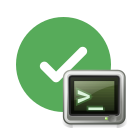

# ⚡ Actionforge Graph Runner
<!-- markdownlint-disable MD033 -->

<div align="center" width="100%">

  

[](https://app.actionforge.dev/github/actionforge/actrun-cli/main/.github/workflows/graphs/build-test-publish.act)
[](https://go.dev)
[](https://www.github.com/actionforge/legal/blob/main/LICENSE.md)

</div>

`actrun` is the CLI execution engine for [Actionforge](https://www.actionforge.dev). It is a binary designed to execute `.act` graph files natively on your machine, CI runners, or render nodes.

It handles the traversal, concurrency, and data flow of visual graphs created in the Actionforge web app. It supports GitHub Actions, GitHub Actions workflows and custom 3D/CG/VFX pipelines.

## 🏁 Getting Started

### 📥 Installation

Requires **Go 1.25+**.

```bash
git clone git@github.com:actionforge/actrun-cli.git
cd actrun-cli
go mod tidy
go run . # to run without building
go build -o actrun . # to build the binary

```

### ✏️ Editor Setup

While `actrun` handles execution, visit [app.actionforge.dev](https://app.actionforge.dev) to build and edit `.act` files.

## 🚀 Usage

The basic syntax is `actrun [filename|url] [flags]`.

### ▶️ 1. Execute a Graph

Run a graph file directly. The CLI will load the graph, resolve dependencies, and execute the node chain.

```bash
./actrun ./my_graph.act


```

### 🔌 2. Pass Arguments

You can pass arbitrary arguments to the graph. `actrun` interprets arguments following the graph filename as inputs to the execution context.

```bash
# Pass inputs to the graph logic
actrun ./my_graph.act --target="production" --verbose


```

If you need to strictly separate CLI flags from graph arguments, use the `--` separator:

```bash
actrun --env-file=.env -- ./my_graph.act --target="production"


```

### 🌍 3. Load Environment Variables

Inject environment variables from a file before execution starts using `--env-file`.

```bash
actrun --env-file=.env.local ./my_graph.act


```

### 🛡️ 4. Validation

Before running a graph, you can check the graph for structural errors, disconnected pins, type mismatches, or missing required inputs without executing it.

```bash
actrun validate ./complex_workflow.act


```

## 🔮 Advanced Features

### 🕸️ Debug Sessions

`actrun` can bridge your local terminal to the Actionforge web app for visual debugging. You can either connect to your browser session via a debug session token that your browser provided, or you can let the CLI intiate a debug session by using `--create-debug-session`. The latter will print a link to stdout that you can open in your browser and the debug session will immediately begin.

```bash
actrun --create-debug-session ./my_graph.act


```

### 🚦 Concurrency Control

By default, concurrency is enabled but you can disable it using the `--concurrency` flag. It will force all "Concurrent" nodes to run in serial instead.

```bash
# Disable concurrency for strict serial execution
actrun --concurrency=false ./sequential_task.act


```

## 🔧 Perforce Support (Optional)

To build with Perforce (P4) support, you need the Perforce C/C++ API and OpenSSL installed.

1. Download the [Helix C/C++ API](https://www.perforce.com/downloads/helix-core-c/c++-api) and place it in `p4api/<os>/` (e.g. `p4api/macos/`).

2. Set the required environment variables before building:

```bash
export CGO_CPPFLAGS="-I$(pwd)/p4api/macos/include -g"
export CGO_LDFLAGS="-Wl,-no_warn_duplicate_libraries -L$(pwd)/p4api/macos/lib -L/opt/homebrew/opt/openssl@1.1/lib -lp4api -lssl -lcrypto -framework ApplicationServices -framework Foundation -framework Security"
export CGO_ENABLED=1
```

3. Build or run with the `p4` tag:

```bash
go run -tags p4 . agent --token=<your-token> --server=<server-url>
```

## 🛠️ Development Commands

If you are contributing to the core nodes or the CLI itself, the `dev` subcommand provides utilities to maintain the internal registry.

* **Generate Stubs**: Rebuilds the Go interfaces for nodes based on embedded YAML definitions.

```bash
go run -tags=dev,api,cpython . dev generate_stubs

```

## ⚖️ Full License Text

For the complete legal documentation and full terms of service, please refer to:

* 📄 **Source Code:** [actionforge/legal/LICENSE.md](https://github.com/actionforge/legal/blob/main/LICENSE.md)
* 🌐 **Official Website:** [actionforge.dev/eula](https://www.actionforge.dev/eula)
